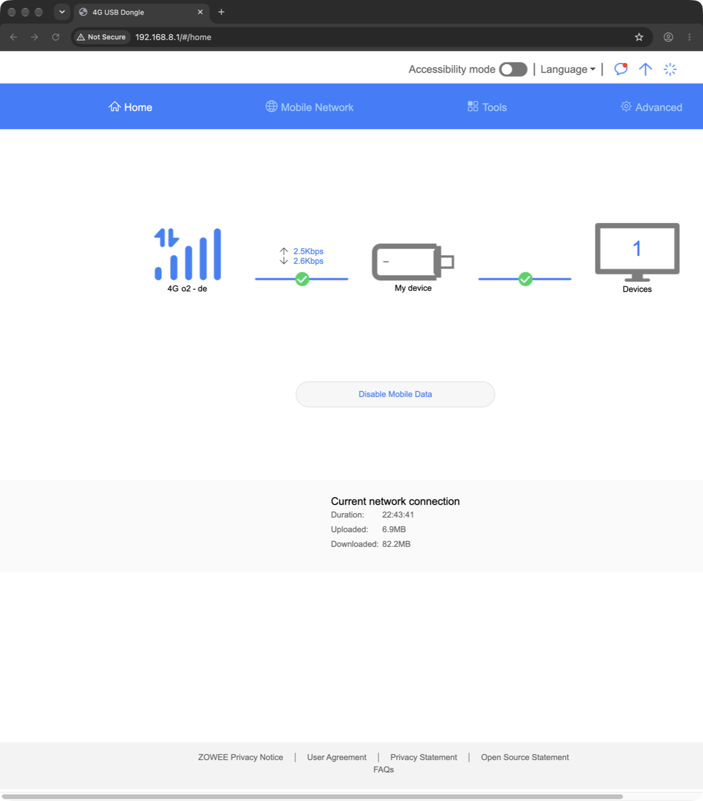
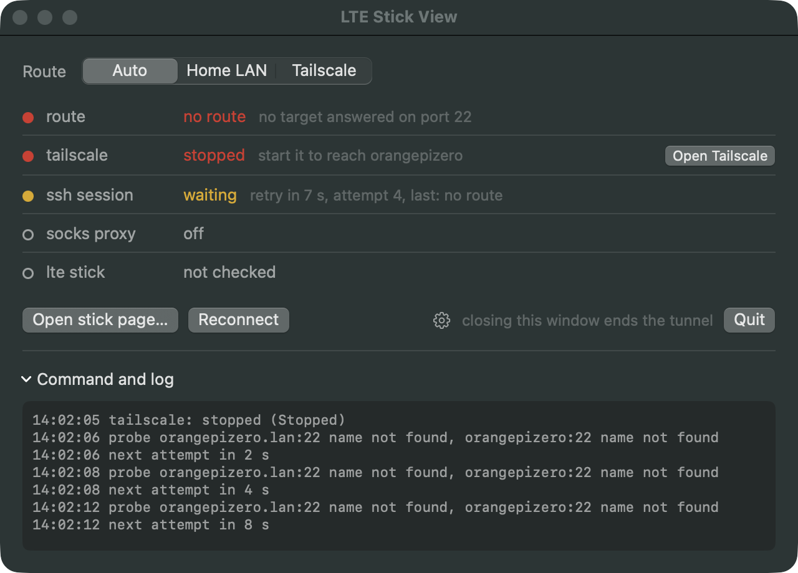
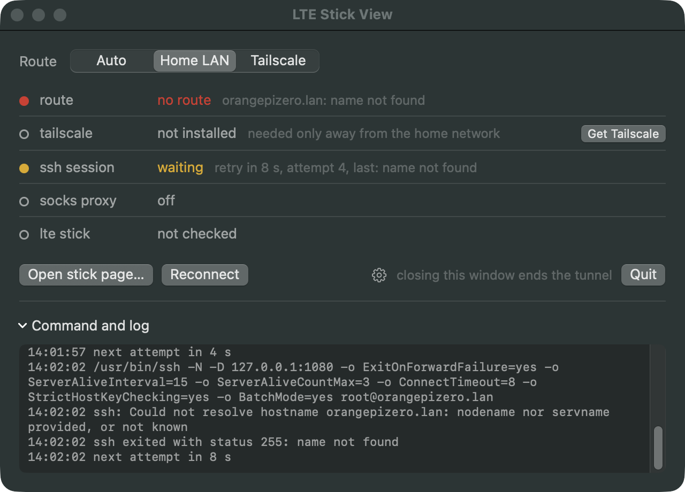
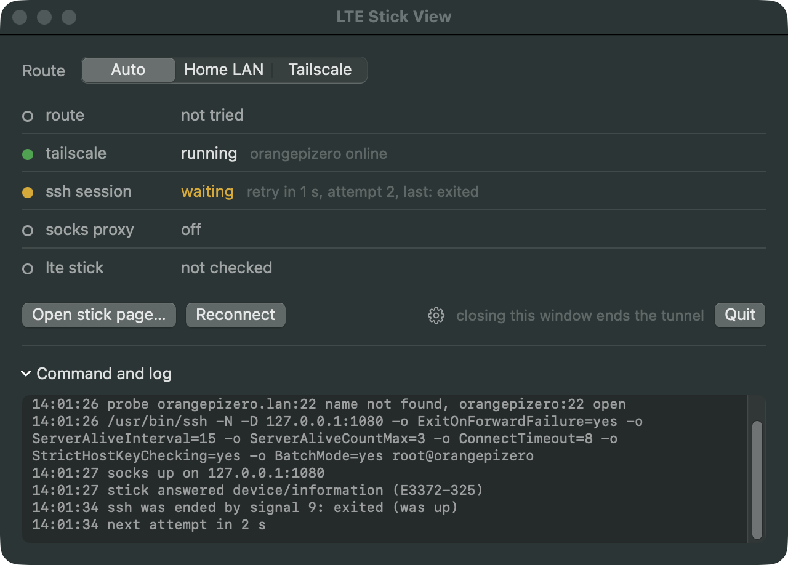
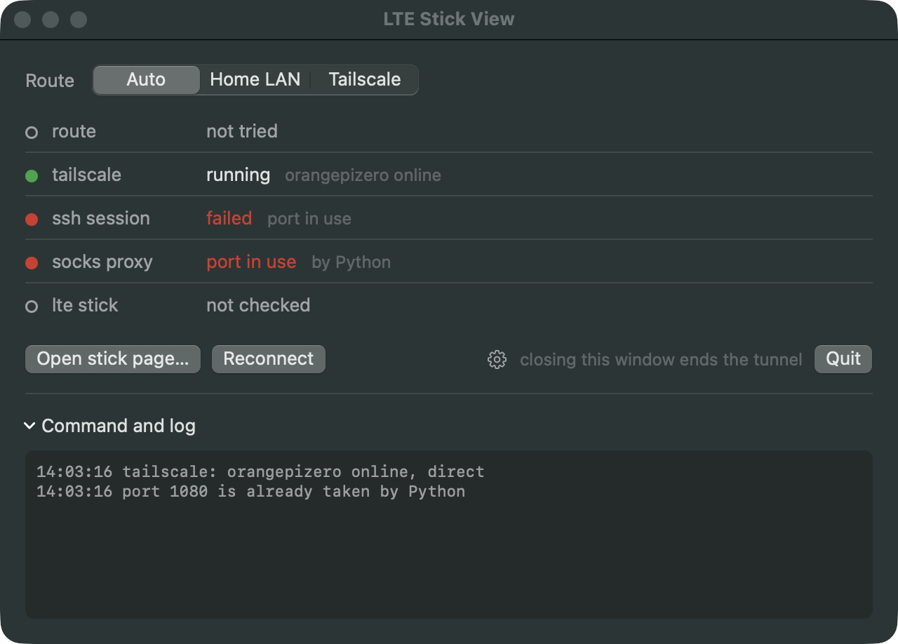
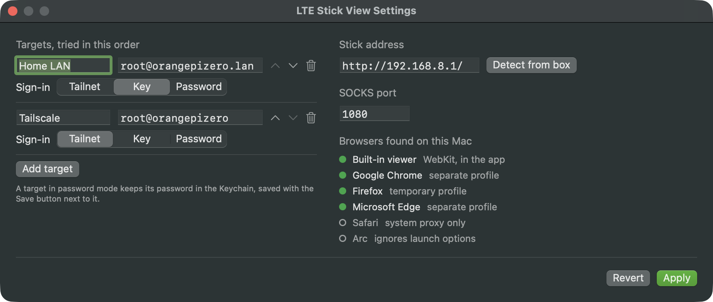
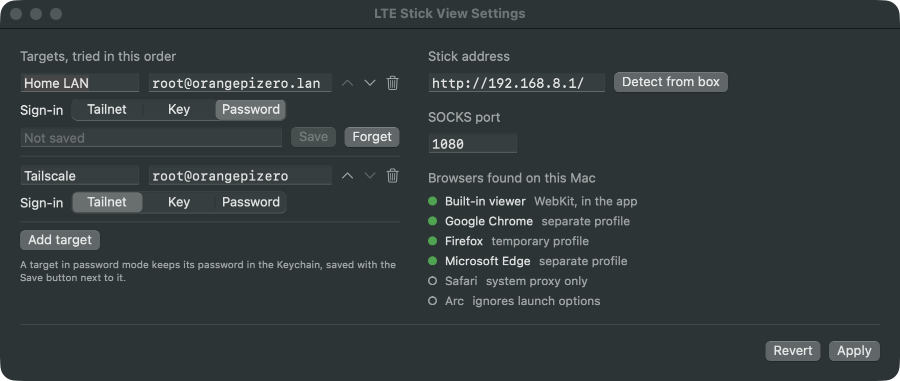

<div align="center">

# lte-usb-modem-remote-stick-view

**LTE Stick View: a small Mac app that opens the configuration page of a USB LTE modem plugged into a remote, headless Linux board (an Orange Pi Zero in our case, but any SBC or server you can SSH into), by tunnelling through that board, from one window.**


</div>

<br>

Many USB LTE modems run in a router mode (Huawei calls it HiLink) and serve their own configuration page on a small private network that only the computer they are plugged into can see. When that computer is a board with no screen, somewhere else, reaching the page from a laptop takes an SSH tunnel and a specially started browser. This app does that from `/Applications`: it picks the route to the board, holds the tunnel, proves the modem answers, and opens the page in the viewer you choose.

<br>

> [!NOTE]
> All seven build steps are done, and the app runs from `/Applications`. A few things can only be checked at home or by hand; they are tracked in [TRACKING.md](TRACKING.md).

> [!TIP]
> **Our setup is the example throughout**: an Orange Pi Zero reached as `root@orangepizero.lan` at home and `root@orangepizero` over Tailscale, with a Huawei E3372h-320 modem at `192.168.8.1`. Wherever these appear, the general form is given first; put in your own user, board names and modem address.

---

## Contents

- [lte-usb-modem-remote-stick-view](#lte-usb-modem-remote-stick-view)
  - [Contents](#contents)
  - [At a glance](#at-a-glance)
  - [Why this exists](#why-this-exists)
    - [The chore](#the-chore)
    - [What the app does instead](#what-the-app-does-instead)
  - [What it looks like](#what-it-looks-like)
  - [What was considered](#what-was-considered)
    - [Technical](#technical)
    - [Experience](#experience)
    - [Edge cases](#edge-cases)
  - [Install](#install)
  - [Use](#use)
  - [Where to start](#where-to-start)
  - [Repository layout](#repository-layout)
  - [Tracking](#tracking)
  - [Related](#related)
  - [License](#license)

---

## At a glance

- **What it does**: an SSH SOCKS tunnel to the board the modem is plugged into, then the modem's page through it, in a built-in viewer or a browser picked each time.
- **Routes**: the board on its home network (`<user>@<board>.lan`, ours `root@orangepizero.lan`) or over a tailnet (`<user>@<tailnet-name>`, ours `root@orangepizero`), chosen automatically by which one answers, with the Tailscale path (direct or relayed) on the route line and a reconnect of its own when the link drops. Any number of targets can be set, in any order.
- **Tailscale is optional**: needed only away from the home network. The app never asks for it at launch; a status line says when it is the reason the box cannot be reached and offers *Get Tailscale* or *Open Tailscale* right there.
- **Sign-in**: Tailscale SSH on the tailnet, the Mac's key on the LAN, a Keychain password for any target that asks.
- **Viewers**: the built-in WebKit viewer, which waits for the tunnel and reloads after a drop by itself; Chrome, Edge and the other Chromium browsers with a profile of their own; Firefox with a temporary profile. Safari and Arc are listed with why they cannot be used.
- **Only the modem goes through the tunnel**: a browser gets a proxy rule for the modem's address alone, so its updates and other tabs never leave through the board and its SIM.
- **Leaves nothing behind**: no system proxy changes; quitting ends the tunnel.
- **Built with**: Swift and SwiftUI, no third-party dependencies.

---

## Why this exists

A USB LTE modem in router mode shows up on the board as a network card with its own little subnet, and the modem sits at the gateway address of that subnet with a web page for the SIM, the signal, the APN and the data counters. Only the board can reach that address. Your laptop cannot, even when it can SSH into the board.

The obvious fix, an SSH **port forward**, often gives a blank page. Many of these modems check the `Host` header of every request, and a forwarded request arrives as `localhost:8081` instead of the modem's own address, so the modem redirects the browser to an address the laptop has no route to.

What works is a **SOCKS proxy** through the board: `ssh -D` opens a local port, the browser sends every request through it, and the board opens each connection on the browser's behalf. The browser asks for the modem by its real address, the `Host` header is right, and the page loads.

### The chore

By hand it takes two terminals: an `ssh -D` tunnel in one and a browser started to use it in the other, because a plain port forward does not work. In general, with `<user>@<board>` the board's SSH login, `<modem>` the modem's address on the board's side (the gateway of the modem's network, often `192.168.8.1` for Huawei HiLink sticks), and `1080` any free local port:

> [!IMPORTANT]
> In our case `<user>@<board>` is `root@orangepizero.lan` at home and `root@orangepizero` over Tailscale anywhere else, and `<modem>` is `192.168.8.1`, a Huawei E3372h-320 in HiLink mode. The outputs below were captured on `2026-09-25` over Tailscale. Our board's side is written up in [runbook 05, Read the stick](https://github.com/dattasaurabh82/orangepizero-solar-server/blob/main/runbooks/05-network-setup.md#read-the-stick).

<details>
<summary>The commands, and what they return in our case</summary>

<br>

**What does not work: a plain port forward.**

```bash
ssh -N -L 8081:<modem>:80 <user>@<board>
curl -s -D - -o /dev/null http://localhost:8081/
```

For us, `ssh -N -L 8081:192.168.8.1:80 root@orangepizero`. The modem answers with a redirect and no body:

```text
HTTP/1.1 307
LOCATION: http://192.168.8.1/html/index.html?origin=xxx
Content-Type: text/plain
Content-Length: 0
```

**What works, by hand, every time:**

1. Open a first terminal and start the SOCKS proxy, picking the host name by where you are, and leave the session open:

```bash
ssh -D 1080 <user>@<board-on-the-lan>       # at home, for us root@orangepizero.lan
ssh -D 1080 <user>@<board-tailnet-name>     # anywhere else, for us root@orangepizero
```

2. Open a second terminal and start a browser that uses that proxy, with a profile of its own so the everyday browser is untouched:

```bash
open -na "Google Chrome" --args --proxy-server="socks5://127.0.0.1:1080" --user-data-dir=/tmp/stick-browser http://<modem>/
```

**Careful:** This sends everything that browser does through the board, not only the modem's page. On a board whose internet is a SIM, that costs data; the app uses a proxy rule for the modem's address alone instead (see [External browsers](SPEC.md#external-browsers)).

3. Or check from the command line through the same proxy:

```bash
curl -s -D - -o /dev/null --socks5-hostname 127.0.0.1:1080 http://<modem>/
```

For us, with `<modem>` being `192.168.8.1`:

```text
HTTP/1.1 200 OK
Content-Type: text/html
Content-Length: 3106
```

4. When done, close the browser and end the SSH session.

</details>

That is two terminals, a host name to remember, a long browser command to find again, and a session that is easy to leave running.

*The app exists so that none of this has to be remembered.*

### What the app does instead

- **Picks the route**: tries each target, the LAN name and the tailnet name by default, and uses the first that answers.
- **Holds the tunnel**: the same `ssh -D`, started and stopped with the window, with the exact command visible in the log.
- **Proves the chain**: shows green only once the modem itself has answered through the tunnel.
- **Opens the page**: in a built-in viewer or a browser picked each time, started with its own profile and a proxy rule for the modem's address alone.

For another board or modem, change the targets and the modem's address in Settings; our box is only the default.

**Everything else is in [SPEC.md](SPEC.md).**

---

## What it looks like

Screenshots of the installed app on `2026-09-25`, taken from the office over Tailscale. The two below are what you see most of the time; the rest open on a click. The failure states were produced on purpose, with the app's `--simulate` switch or a port held by another program.

<table>
<tr>
<td width="50%" valign="top">
<br>
<b>Connected.</b> Auto tried both targets, found the LAN name unknown from here, and used Tailscale. Five lines, each with its own dot and words; the exact ssh command and every step in the log.
</td>
<td width="50%" valign="top">
<br>
<b>Asks where, every time.</b> The built-in viewer and the browsers found on this Mac. Tested ones green, Safari and Arc greyed with the reason; the last one used is labelled, never preselected.
</td>
</tr>
</table>

<details>
<summary><b>Opening the page</b>: the built-in viewer, and a browser (2 screenshots)</summary>

<br>

<table>
<tr>
<td width="50%" valign="top">
<br>
<b>Built-in viewer.</b> A WebKit window whose traffic goes only through the tunnel, with where it goes on the right. It forgets everything when closed.
</td>
<td width="50%" valign="top">
<br>
<b>Or a browser.</b> A separate Chrome instance with a profile of its own, and a proxy rule for the modem's address only. The everyday Chrome stays as it is.
</td>
</tr>
</table>

</details>

<details>
<summary><b>When something is not right</b>: Tailscale missing or stopped, the quiet case, a dropped link, a taken port, the viewer waiting (6 screenshots)</summary>

<br>

<table>
<tr>
<td width="50%" valign="top">
<br>
<b>Says why, and offers the fix.</b> Away from home without Tailscale: the tailscale line turns red, names the cause and puts <i>Get Tailscale</i> right there. Retries keep counting down.
</td>
<td width="50%" valign="top">
<br>
<b>Stopped or signed out.</b> The same line with <i>Open Tailscale</i>; the app reads Tailscale again after opening it and connects once it is up.
</td>
</tr>
<tr>
<td width="50%" valign="top">
<br>
<b>Quiet when it does not matter.</b> The home network chosen by hand: a missing Tailscale is not the problem here, so its line stays hollow and says it is needed only away from home.
</td>
<td width="50%" valign="top">
<br>
<b>Comes back by itself.</b> ssh killed mid-session: the app waits 2, 4, 8, 16, then 30 seconds between attempts, chooses the route again each time, and was green again 4 seconds after this.
</td>
</tr>
<tr>
<td width="50%" valign="top">
<br>
<b>Names what is in the way.</b> Another program holds port 1080: the app names it, does not retry, and leaves it alone. Tailscale is still read and shown.
</td>
<td width="50%" valign="top">
<br>
<b>Opened early, waits.</b> The viewer opened before the tunnel was up says so, and loads the page the moment the modem answers; after a drop it reloads by itself.
</td>
</tr>
</table>

</details>

<details>
<summary><b>Settings</b>: targets, modem address and port, and a target with a password (2 screenshots)</summary>

<br>

<table>
<tr>
<td width="50%" valign="top">
<br>
<b>Settings.</b> Targets in the order Auto tries them, each with how it signs in; the modem's address with <i>Detect from box</i>; the SOCKS port; the browsers found.
</td>
<td width="50%" valign="top">
<br>
<b>Passwords stay in the Keychain.</b> A target in password mode gets a field with <i>Save</i> and <i>Forget</i>; ssh gets the password through the app's own one-time helper.
</td>
</tr>
</table>

</details>

---

## What was considered

Three short lists, closed by default: what was decided on the technical side, on the experience side, and which edge cases are covered. Each row links to the SPEC section that explains it in full.

### Technical

<details>
<summary>Nine technical decisions, and how each is handled</summary>

<br>

| What | How the app handles it |
| --- | --- |
| Reusing what already works | It runs the Mac's own `/usr/bin/ssh`, so `~/.ssh/config`, `known_hosts`, keys and Tailscale SSH apply unchanged. [The tunnel](SPEC.md#the-tunnel) |
| Green means the whole chain | A line turns green only once the modem itself has answered through the tunnel, not when ssh starts. [When a line turns green](SPEC.md#when-a-line-turns-green) |
| The modem's Host check | A SOCKS proxy, not a port forward, so every request carries the modem's real address. [Why this exists](SPEC.md#why-this-exists) |
| Only the modem through the tunnel | Browsers get a proxy auto-config rule for the modem's address alone. With everything proxied, a fresh Firefox sent its first-run downloads out through the board, and our board's IPv6 goes over the SIM. [External browsers](SPEC.md#external-browsers) |
| Passwords | Kept only in the Keychain; handed to ssh by the app's own askpass helper over a private one-time socket, never on disk, the command line or in a lasting variable. [Signing in](SPEC.md#signing-in) |
| Nothing left behind | Quitting stops ssh, also on a plain `kill`; after a crash, the next start ends the leftover ssh it recorded. No system proxy is ever changed. [Lifecycle](SPEC.md#lifecycle) |
| A port that only looks taken | The free-port check binds the way ssh does, so connections in `TIME_WAIT` after a viewer session are not mistaken for a listener. [Lifecycle](SPEC.md#lifecycle) |
| Values from the system | Browsers, the Tailscale app and CLI, the modem's address (*Detect from box*) and the Tailscale path are read, not hardcoded. [Settings](SPEC.md#settings) |
| Cost | Zero when not running; one idle ssh and a small window when it is. [Build and install](SPEC.md#build-and-install) |

</details>

### Experience

<details>
<summary>Seven choices about how it feels to use</summary>

<br>

| What | How the app handles it |
| --- | --- |
| One window, one lifetime | Opening the app connects; closing the window quits and ends the tunnel. Nothing lives on in the menu bar. [Lifecycle](SPEC.md#lifecycle) |
| Every fact on its own line | Five lines, each with a dot (green right, yellow look, red broken, hollow not present) and state words coloured by meaning. [Status lines](SPEC.md#status-lines) |
| Say why, then offer the fix | Red lines name the reason; the tailscale line carries *Get Tailscale* or *Open Tailscale* when that is the fix. [Without Tailscale](SPEC.md#without-tailscale) |
| Quiet unless it matters | Tailscale is optional; its line turns red only when it is the reason the board cannot be reached. [Without Tailscale](SPEC.md#without-tailscale) |
| Ask, do not assume | The viewer is chosen each time; the last one is labelled, not preselected. [Opening the stick page](SPEC.md#opening-the-stick-page) |
| Nothing to remember | The route is picked by what answers; the command, every probe and every failure are in the log. [Choosing the route](SPEC.md#choosing-the-route) |
| Hands off the modem | The app only loads the modem's page; its live controls, such as *Disable Mobile Data*, are never touched. [The built-in viewer](SPEC.md#the-built-in-viewer) |

</details>

### Edge cases

<details>
<summary>Thirteen situations, and what the app does in each</summary>

<br>

| Situation | What the app does |
| --- | --- |
| Away from home | Auto skips the LAN name and uses the tailnet; the route line says which names did not answer. |
| The link drops | Waits 2, 4, 8, 16, then 30 seconds between attempts, choosing the route again each time; a network change tries at once. [When the link drops](SPEC.md#when-the-link-drops) |
| No Tailscale, stopped, signed out, or the board not on this tailnet | Each named on the tailscale line, red only when it blocks, with the fix where there is one. [Without Tailscale](SPEC.md#without-tailscale) |
| Sign-in refused, host key unknown or changed | Red with that reason and no retry, because waiting cannot fix it. [Signing in](SPEC.md#signing-in) |
| Port already taken | The holder named, no retry, the other program left alone. [Lifecycle](SPEC.md#lifecycle) |
| Viewer opened before the tunnel | Waits, and loads the page when the modem answers. [The built-in viewer](SPEC.md#the-built-in-viewer) |
| Tunnel drops with the page open | The viewer reloads once the modem answers again. [The built-in viewer](SPEC.md#the-built-in-viewer) |
| A browser picked before the tunnel | It opens as soon as the modem answers. [Opening the stick page](SPEC.md#opening-the-stick-page) |
| Browsers that cannot carry the rule | Safari (system proxy only) and Arc (ignores launch options) listed, greyed, with the reason. [External browsers](SPEC.md#external-browsers) |
| The everyday browser is open | A separate instance with its own profile; the running one is never touched. [External browsers](SPEC.md#external-browsers) |
| Firefox restarts itself | Its throwaway profile is removed at quit, or at the next launch if Firefox was still open. [External browsers](SPEC.md#external-browsers) |
| The app crashed | The next start ends the ssh it left behind. [Lifecycle](SPEC.md#lifecycle) |
| A password target without a password | Red *no password saved*, pointing to Settings. [Signing in](SPEC.md#signing-in) |

</details>

---

## Install

It builds on the Mac that will run it, from source; there is no download.

**What it needs**: macOS 14 or later, and Xcode or the Xcode command line tools with Swift 6. The Tailscale app is optional, needed only to reach the board away from its home network.

```bash
git clone git@github.com:dattasaurabh82/lte-usb-modem-remote-stick-view.git
cd lte-usb-modem-remote-stick-view
scripts/build-app.sh
```

The script builds a release binary, puts it into `LTE Stick View.app` with its icon, signs it for this Mac, and copies it into `/Applications`. The end of its output:

```text
== sign (ad hoc, for this Mac only)
build/LTE Stick View.app: replacing existing signature
signature ok
installed: /Applications/LTE Stick View.app
```

> [!TIP]
> `scripts/build-app.sh --no-install` builds into `build/` only. To update, quit the app and run the script again; it refuses to replace a copy that is running.

> [!IMPORTANT]
> The signature is ad hoc, made on this Mac for this Mac. The app is not notarized and is not meant to be copied to other Macs; build it on each one.

---

## Use

1. Open **LTE Stick View** from `/Applications`. It connects at once, over the home network if the board answers there, over Tailscale otherwise.
2. Wait for the five lines to turn green. If one turns red, its words say why, and the **tailscale** line offers a fix when Tailscale is the reason.
3. Press **Open stick page…** and pick the built-in viewer or a browser. Only the modem's address goes through the tunnel.
4. Close the window, or press **Quit**, and the tunnel is gone.

**First run on another board or modem**: open Settings with Cmd-comma or the gear, set the targets (`user@host` and how each signs in), and press **Detect from box** to read the modem's address from the board.

> [!WARNING]
> The app never answers a host key question. Connect to each target once from Terminal first, so its key is in `~/.ssh/known_hosts`; otherwise the ssh line turns red *host key unknown*.

---

## Where to start

- **To understand the design**: [SPEC.md](SPEC.md), with the chain diagram, every ssh flag explained, and the status words.
- **To see where it stands**: [TRACKING.md](TRACKING.md), with the roadmap, what is still to check, and the known gaps.
- **To install and use it**: [Install](#install) and [Use](#use) above.
- **To check it from a terminal**: [Building and checking from the command line](SPEC.md#building-and-checking-from-the-command-line) in SPEC: `--self-test`, `--simulate`, `--askpass-test` and the other switches.
- **To see the real window**: [What it looks like](#what-it-looks-like) above, with the failure states in its collapsed groups.
- **To change a mockup**: [assets/README.md](assets/README.md).
- **For the manual commands this app replaces**: the server repo's [runbook 05, Read the stick](https://github.com/dattasaurabh82/orangepizero-solar-server/blob/main/runbooks/05-network-setup.md#read-the-stick).

---

## Repository layout

<details>
<summary>The files, one line each</summary>

<br>

```text
lte-usb-modem-remote-stick-view/
├── README.md        this page
├── SPEC.md          the design: tunnel, sign-in, routes, viewers, status lines
├── TRACKING.md      roadmap, what is still to check, known gaps
├── LICENSE          GNU LGPL 2.1
├── Package.swift    the Swift package: one app target, macOS 14 and later
├── .gitignore       ignores build output and the local working docs
├── scripts/
│   ├── build-app.sh     builds, signs and installs LTE Stick View.app
│   └── make-icon.swift  draws Resources/AppIcon.png
├── Resources/
│   ├── Info.plist       the bundle's name, identifier, version, icon, minimum macOS
│   └── AppIcon.png      the icon at 1024 pixels; the build makes the .icns from it
├── Sources/
│   └── LTEStickView/
│       ├── App.swift          app entry, quit handling, the self-test and askpass test modes
│       ├── ContentView.swift  the main window: route switch, five lines, fix buttons, log
│       ├── Tunnel.swift       the ssh process, readiness, failure reasons, retries, network changes, leftover cleanup
│       ├── Route.swift        the port-22 probe for Auto, finding Tailscale and reading its status
│       ├── Viewer.swift       the built-in viewer: a WebKit window that goes only through the tunnel
│       ├── Browsers.swift     finding browsers, the proxy rule for the stick only, launching, cleanup
│       ├── SettingsView.swift the Settings window: targets, stick address, port, passwords
│       ├── Askpass.swift      Keychain passwords and the one-time askpass helper for ssh
│       ├── System.swift       port checks, lsof and ps lookups, the stick probe
│       └── Model.swift        targets, saved settings, status lines
└── assets/          mockups (HTML sources and rendered PNGs) and screenshots of the app, index in its README
```

</details>

---

## Tracking

All seven build steps are done. The roadmap, the checks that still need a place or a hand (the home network path, a real password login, a network change, the Settings buttons), and the gaps that are known are in [TRACKING.md](TRACKING.md).

---

## Related

- [orangepizero-solar-server](https://github.com/dattasaurabh82/orangepizero-solar-server): the box this app reaches, and the stick's setup in [runbook 05](https://github.com/dattasaurabh82/orangepizero-solar-server/blob/main/runbooks/05-network-setup.md#read-the-stick).

---

## License

LTE Stick View is released under the GNU Lesser General Public License, version 2.1. The full text is in [LICENSE](LICENSE).
