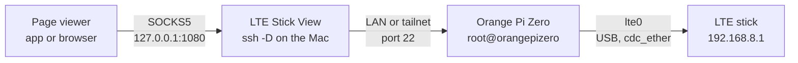
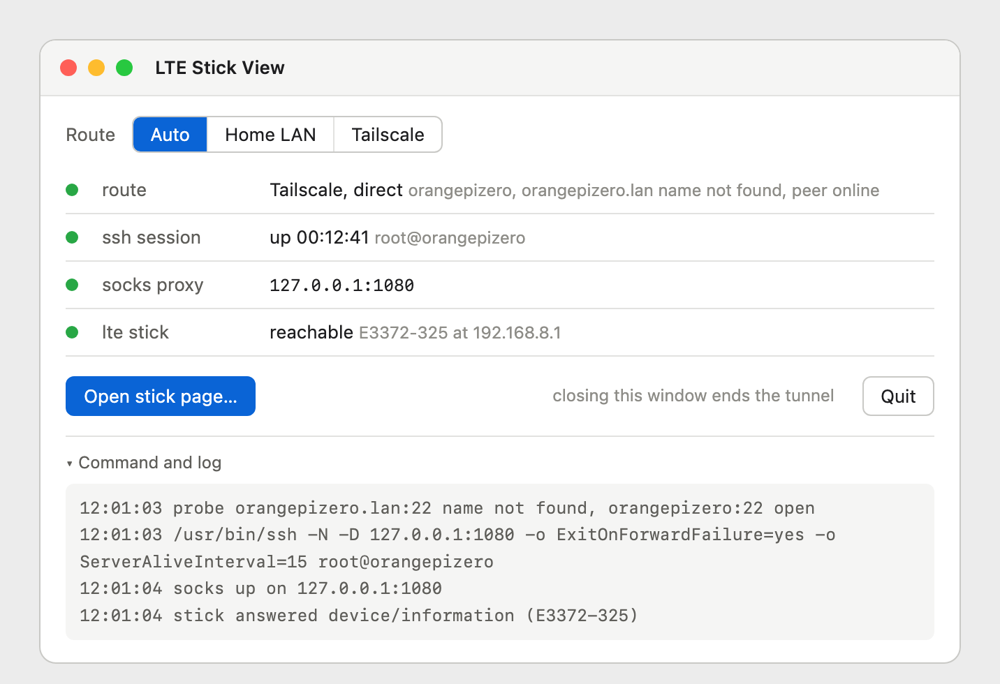
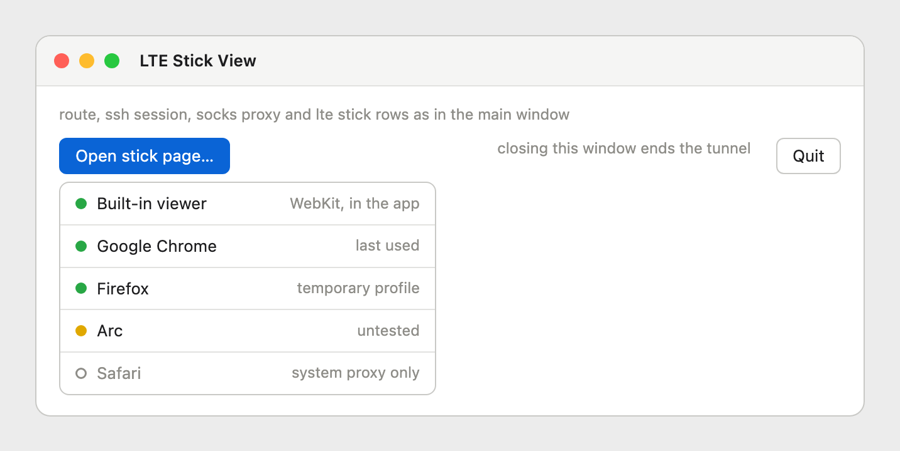
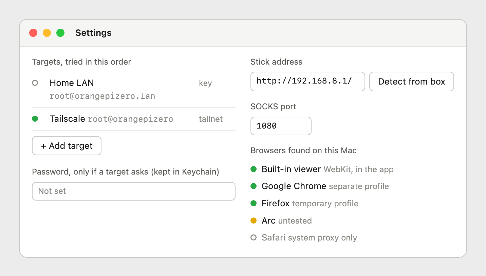

# LTE Stick View specification

> [!NOTE]
> **Status**: spec written and mockups rendered, no app code yet
>
> **Verified**: `2026-09-25`, the Mac it is built for (see [Build and install](#build-and-install)), the stick's name and its route on the box; the manual SOCKS route this app wraps was checked on `2026-09-23` in the server repo
>
> **Open**: whether Arc honours `--proxy-server` and `--user-data-dir`; the Firefox launch is written from documentation and not yet run
>
> **Next**: step 2, the tunnel core (see the [roadmap](README.md#roadmap))

---

<br><br>

## Contents

- [LTE Stick View specification](#lte-stick-view-specification)
  - [Contents](#contents)
  - [Why this exists](#why-this-exists)
  - [How it works](#how-it-works)
  - [The tunnel](#the-tunnel)
  - [Signing in](#signing-in)
  - [Choosing the route](#choosing-the-route)
  - [When a line turns green](#when-a-line-turns-green)
  - [Opening the stick page](#opening-the-stick-page)
    - [The built-in viewer](#the-built-in-viewer)
    - [External browsers](#external-browsers)
  - [Status lines](#status-lines)
  - [Settings](#settings)
  - [Lifecycle](#lifecycle)
  - [Build and install](#build-and-install)
  - [Mockups](#mockups)
  - [Out of scope](#out-of-scope)

---

## Why this exists

The **LTE stick** (a Huawei E3372h-320 in HiLink mode) sits on the Orange Pi Zero's USB hub and serves its own web page at `http://192.168.8.1/`. Only the box can reach that address, over its `lte0` interface. From the Mac the page has to go through the box, and the obvious way does not work: a plain port forward gives a blank page, because the stick checks the `Host` header and redirects anything that is not `192.168.8.1` to an address the Mac cannot reach. The full story, and the manual commands this app replaces, are in the server repo under [runbook 05, Read the stick](https://github.com/dattasaurabh82/orangepizero-solar-server/blob/main/runbooks/05-network-setup.md#read-the-stick).

What works is a **SOCKS proxy** through the box: `ssh -D 1080` on the Mac, then a browser that sends its requests through `127.0.0.1:1080`, so it asks for `192.168.8.1` by its real address and the box does the reaching. That takes two terminals, the right host name for wherever we are, and a hand-typed Chrome command. This app does the same thing from one window launched from `/Applications`.

> [!IMPORTANT]
> The app changes nothing on the box and nothing in the Mac's system network settings. It starts one `ssh` process and, when asked, a browser. Quit the app and the tunnel is gone; a browser it started stays open but can no longer reach the stick.

---

## How it works

The chain has four parts and three hops. The viewer talks SOCKS to the app's local port, `ssh` carries it to the box over whichever route answers, and the box reaches the stick over USB.



Everything the app does falls into four jobs: pick a route, hold the tunnel open, prove the chain works end to end, and open the page in the viewer you choose.

---

## The tunnel

The app wraps the system's own `ssh` rather than embedding an SSH library. That keeps everything that already works on the Mac: `~/.ssh/config`, `known_hosts`, the keys, and Tailscale SSH on the tailnet path. The command, with the route's target filled in:

```bash
/usr/bin/ssh -N -D 127.0.0.1:1080 \
  -o ExitOnForwardFailure=yes \
  -o ServerAliveInterval=15 -o ServerAliveCountMax=3 \
  -o ConnectTimeout=8 \
  -o StrictHostKeyChecking=yes \
  -o BatchMode=yes \
  root@orangepizero
```

Each part is there for a reason. `-N` opens no shell, only the forward. `-D 127.0.0.1:1080` is the SOCKS proxy, bound to the loopback address explicitly so nothing else on the network can use it. `ExitOnForwardFailure=yes` makes ssh quit instead of sitting there connected but useless when the port is taken. `ServerAliveInterval=15` with `ServerAliveCountMax=3` notices a dead link within about 45 seconds, which matters when the Mac changes networks. `ConnectTimeout=8` keeps a dead route from hanging the window. `StrictHostKeyChecking=yes` refuses unknown or changed host keys instead of asking, because nobody is at a terminal to answer. `BatchMode=yes` is used in key mode only and makes ssh fail fast instead of waiting for a password prompt that will never be seen.

The binary is always called by its absolute path. An app started from Finder gets a minimal `PATH`, so anything found through the shell's `PATH` in Terminal may not be found here.

The exact command, as run, is shown in the window under **Command and log**, together with ssh's own error output. When something fails, the reason is the last line there.

---

## Signing in

There are three ways a target can sign in, and the app picks per target, set in [Settings](#settings).

1. **Tailnet**: the tailnet target (`root@orangepizero`) uses **Tailscale SSH**, which signs in by tailnet identity. No key and no password are involved.
2. **Key**: the LAN target (`root@orangepizero.lan`) uses the Mac's SSH key, set up for this box in `2026-09`. `BatchMode=yes` is on.
3. **Password**: for any target that asks. The password is kept only in the macOS **Keychain**, as a generic password with the service name `LTE Stick View` and the account `user@host`.

For the password case, ssh is started with `SSH_ASKPASS` pointing at the app's own binary and `SSH_ASKPASS_REQUIRE=force` (OpenSSH 8.4 and later; the Mac has 10.3). When ssh needs the password, it runs the app binary as its helper. The helper asks the running app over a private Unix socket, presenting a one-time token, and gets the password once. The password never reaches disk, the command line, or a lasting environment variable. The helper only answers password prompts; anything else it is asked, it declines.

> [!WARNING]
> A host key the Mac has never seen, or one that changed, fails the connection with a red **ssh session** line and the reason in the log. The app never accepts a host key for you. Connect once from Terminal, check the fingerprint, and try again.

> [!NOTE]
> If the tailnet policy ever turns on Tailscale SSH check mode, ssh prints a sign-in URL and waits. The app shows that URL in the log as a link and keeps the ssh line yellow until the check passes.

---

## Choosing the route

The route switch has three positions. **LAN** and **Tailscale** use that target and nothing else. **Auto**, the default, decides on every connect.

In Auto the app probes every target in parallel: it resolves the name and opens a plain TCP connection to port 22, giving up after about 1.5 seconds. Targets are tried in the order set in Settings, so the first one that answers wins. With the defaults that means the LAN at home, because it does not depend on Tailscale being up, and the tailnet anywhere else.

The **route** line also shows what Tailscale knows about the box. The app reads `tailscale status --json`, finds the peer whose name matches the tailnet target, and reports whether it is online and whether the path is direct or relayed through a DERP server. The CLI is looked for at `/usr/local/bin/tailscale` first and then inside the app at `/Applications/Tailscale.app/Contents/MacOS/Tailscale`, always run with `TAILSCALE_BE_CLI=1`, because without it the bundled binary can decide it was started as the GUI app.

> [!TIP]
> If neither Tailscale path exists, Auto still works: the TCP probe alone decides. The route line then says the tailnet state is unknown instead of showing peer details.

When the Mac changes networks, the app watches the change. If ssh survives it (a tailnet session often does), nothing happens. If ssh dies, the app runs the route choice again and reconnects, waiting 2, 4, 8 and then at most 30 seconds between attempts. It does not switch a working session from the tailnet to the LAN on its own, so an open stick page is never cut off by an improvement.

---

## When a line turns green

The tunnel counts as ready only when the whole chain has answered, not when ssh has started.

1. The app polls `127.0.0.1:1080` every 200 ms until it accepts a connection, for at most 10 seconds.
2. It then fetches `api/device/information` from the stick through the proxy, with a 5 second timeout. That endpoint answers without a session (checked `2026-09-23`).
3. From the answer it takes the model name for the **lte stick** line. The name is whatever the stick reports: ours answers `E3372-325`, not the E3372h-320 it was sold as (read from the box on `2026-09-25`).

While connected, the stick check repeats every 30 seconds. It costs no SIM data: the stick answers over USB and nothing leaves through the mobile network.

---

## Opening the stick page

**Open stick page…** asks every time. It opens a chooser listing the built-in viewer and every usable browser found on the Mac. The one used last carries the label *last used*, but nothing is preselected and no default is stored.

### The built-in viewer

A window inside the app, using WebKit with a data store whose proxy is set to the tunnel: `WKWebsiteDataStore.proxyConfigurations` with a SOCKSv5 `ProxyConfiguration` pointing at `127.0.0.1:1080`. This API exists since macOS 14, and the proxy applies to that one web view only. The store is non-persistent, so no cookies or cache outlive the window. Several viewer windows can be open at once, and closing them does not touch the tunnel.

### External browsers

The list comes from the system: every app registered to open `http` URLs, found with `NSWorkspace.urlsForApplications(toOpen:)`. Each one is matched by bundle identifier against a small table of launch strategies. Apps that match nothing are left out, which is how iTerm and MKPlayer, both registered for `http` on this Mac, stay off the list.

**Chromium family** (Google Chrome, Brave, Microsoft Edge, Chromium, Vivaldi, Arc): started as a separate instance with the proxy and a profile of its own, so the everyday browser and its windows are untouched.

```bash
open -na "Google Chrome" --args \
  --proxy-server="socks5://127.0.0.1:1080" \
  --user-data-dir="$HOME/Library/Application Support/LTE Stick View/profiles/chrome" \
  http://192.168.8.1/
```

**Firefox family** (Firefox, Firefox Developer Edition, Nightly): Firefox has no command-line proxy switch, so the app writes a fresh profile into a temporary folder, with a `user.js` that sets the proxy, and deletes the folder when the app quits.

```javascript
user_pref("network.proxy.type", 1);
user_pref("network.proxy.socks", "127.0.0.1");
user_pref("network.proxy.socks_port", 1080);
user_pref("network.proxy.socks_version", 5);
user_pref("network.proxy.socks_remote_dns", true);
user_pref("browser.shell.checkDefaultBrowser", false);
```

```bash
open -na "Firefox" --args -profile "$TMPDIR/lte-stick-view-firefox" -no-remote -new-instance http://192.168.8.1/
```

**Safari** is listed but greyed out. It only follows the system-wide proxy, and this app does not change system settings.

Each strategy carries a tested flag. A browser whose launch has not been run on this Mac shows a yellow dot and the word *untested*; it still works from the chooser, and the flag is cleared in the table once its launch has been seen to reach the stick. Arc is the first case.

---

## Status lines

The main window has four lines, each with its own dot. Green means working, yellow means look, red means broken, and a hollow grey dot means not present or not tried yet.

- **route**: which target is in use and why. Green *LAN* or *Tailscale, direct*; yellow *Tailscale, relayed* (works, slower); red *no route* when no target answered on port 22; grey *not tried* before the first connect.
- **ssh session**: grey *down*; yellow *connecting*; green *up* with the time since connect and the target; red *failed* with the reason, one of *sign-in refused*, *host key unknown*, *host key changed*, *port in use* or *timed out*.
- **socks proxy**: grey *off*; green with the address, `127.0.0.1:1080`; red *port in use* with the name of the process holding it.
- **lte stick**: grey *not checked*; yellow *checking*; green *reachable* with the model and address; red *no answer* when the box is reachable but the stick is not (unplugged, or `lte0` down on the box).

---

## Settings

- **Targets**: name, `user@host`, sign-in mode (tailnet, key or password), in the order Auto tries them. Defaults: *Home LAN*, `root@orangepizero.lan`, key; *Tailscale*, `root@orangepizero`, tailnet.
- **Password**: stored in the Keychain only, per target, used only by targets in password mode.
- **Stick address**: default `http://192.168.8.1/`. **Detect from box** runs `ip -4 route show default dev lte0` on the box, through the target in use, as one short extra ssh command, and takes the gateway after `via`, so the address comes from the box instead of from memory. On our box the answer is `default via 192.168.8.1 proto dhcp metric 300` (checked `2026-09-25`).
- **SOCKS port**: default `1080`. When saved, the app checks the port is free and suggests the next free one if not.
- **Browsers found on this Mac**: read-only, what was found and how each will be started.

Plain settings live in the app's user defaults (bundle identifier `work.dattasaurabh.LTEStickView`). Secrets live in the Keychain only.

---

## Lifecycle

Closing the main window quits the app, and quitting ends the tunnel: ssh gets `SIGTERM`, then `SIGKILL` after 2 seconds if it is still there, and the temporary Firefox profile is deleted. Browser windows opened through the tunnel stay open but stop loading.

If the app ever dies without cleaning up, its ssh could be left running. To catch that, the app writes the ssh process ID to `~/Library/Application Support/LTE Stick View/ssh.pid`. On the next launch, if that process is still alive and is our ssh, it is ended before anything else starts.

The port is fixed rather than picked at random on each connect, so a browser started earlier keeps working after a reconnect.

---

## Build and install

A native SwiftUI app with no third-party dependencies, built as a Swift package, with macOS 14 as the minimum because of the WebKit proxy API. A script builds the release binary, assembles `LTE Stick View.app` with its `Info.plist` and icon, signs it ad hoc for this Mac, and copies it into `/Applications`. The app costs nothing when it is not running; when it runs, it is one idle ssh process and a small window.

> [!IMPORTANT]
> The Mac it is built and tested on, as read off the machine on `2026-09-25`: macOS 27.0 on Apple silicon, Xcode with Swift 6.4, `OpenSSH_10.3p1` at `/usr/bin/ssh`, Tailscale 1.102.4 (the standalone app, CLI launcher at `/usr/local/bin/tailscale`). Apps registered for `http`: Google Chrome, Safari, Firefox, Arc, MKPlayer and iTerm.

---

## Mockups

These are the agreed mockups, rendered from the HTML sources in [assets/](assets/).



*The main window, connected over the tailnet from the office.*



*The chooser that opens on every click of Open stick page.*



*Settings.*

---

## Out of scope

- **System proxy settings**: never touched, which is also why Safari is out.
- **A menu bar mode**: decided against on `2026-09-25`; the tunnel lives exactly as long as the window.
- **A signal panel**: rsrp, rsrq, sinr and band are already on the box in `boxstat`; the app only proves the stick answers.
- **Distribution**: no notarization or signing for other Macs; this is a tool for one machine.
