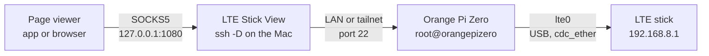
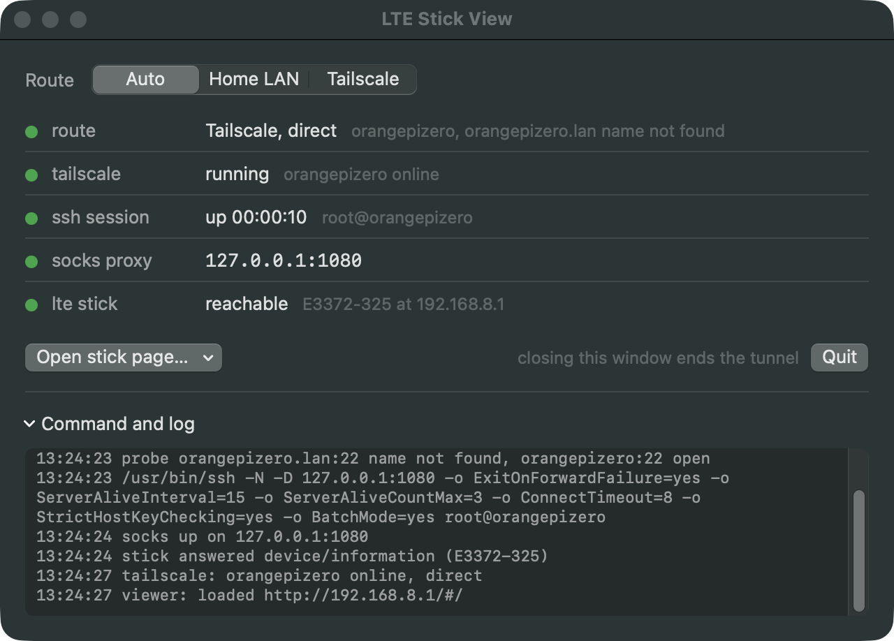
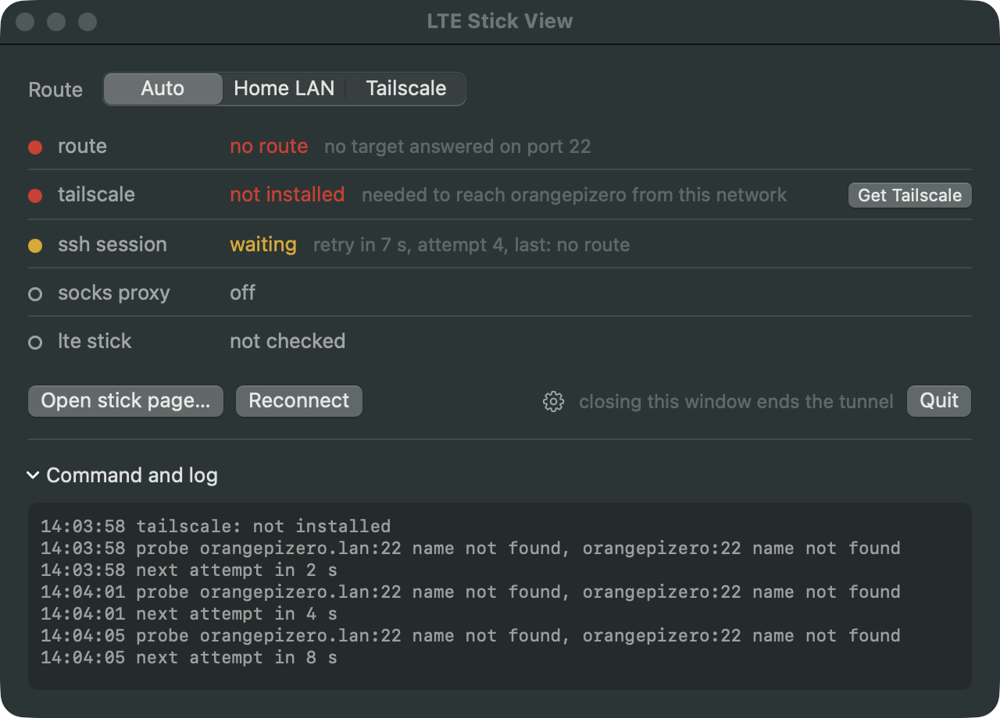
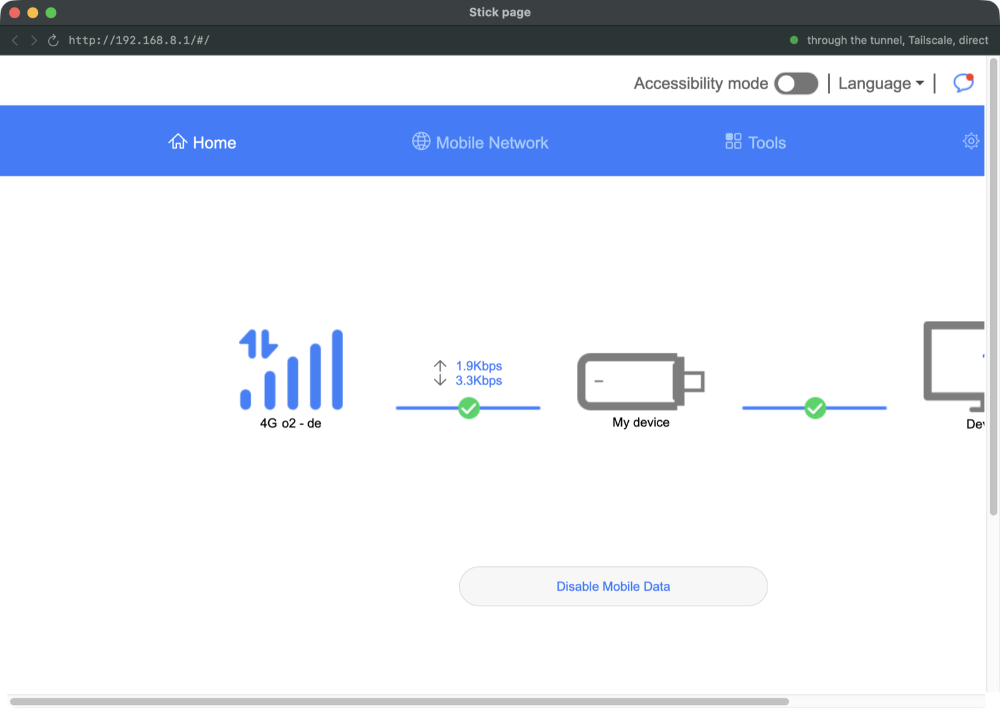
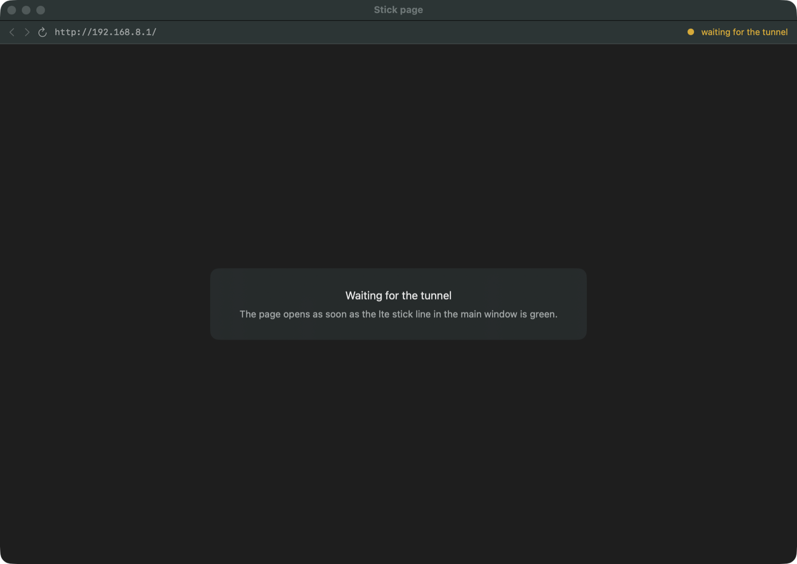
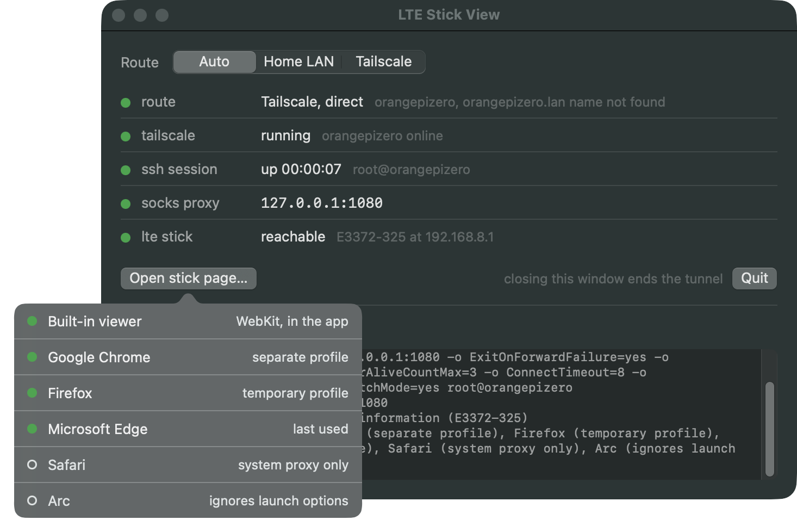

# LTE Stick View specification

> [!NOTE]
> **Status**: external browsers are built (step 5 of 7): the chooser lists the built-in viewer and the browsers found on the Mac, and a browser gets a proxy rule that sends only the stick's address through the tunnel
>
> **Verified**: `2026-09-25` from the office: the stick's page loaded in Chrome 153, Firefox 132 and Edge 154 through the tunnel, with the box connecting only to the stick; Arc 1.164 ignored the launch and is listed as unusable; a browser picked before the tunnel was up opened when the stick answered; the everyday Chrome that was running stayed untouched; and from steps 3 and 4, Auto, the Tailscale line, reconnect, the built-in viewer
>
> **Open**: the LAN path, to be run at home; a real network change; the *relayed* path; a Mac without Tailscale; App Transport Security in the bundled app; Brave, Vivaldi, Chromium and the Firefox variants, listed as untested
>
> **Next**: step 6, settings, Keychain password and askpass (see the [roadmap](README.md#roadmap))

---

<br><br>

## Contents

- [LTE Stick View specification](#lte-stick-view-specification)
  - [Contents](#contents)
  - [Why this exists](#why-this-exists)
  - [How it works](#how-it-works)
  - [The tunnel](#the-tunnel)
  - [Signing in](#signing-in)
  - [Choosing the route](#choosing-the-route)
    - [What Tailscale adds](#what-tailscale-adds)
    - [Without Tailscale](#without-tailscale)
    - [When the link drops](#when-the-link-drops)
  - [When a line turns green](#when-a-line-turns-green)
  - [Opening the stick page](#opening-the-stick-page)
    - [The built-in viewer](#the-built-in-viewer)
    - [External browsers](#external-browsers)
  - [Status lines](#status-lines)
  - [Settings](#settings)
  - [Lifecycle](#lifecycle)
  - [Build and install](#build-and-install)
    - [Building and checking from the command line](#building-and-checking-from-the-command-line)
  - [Screenshots](#screenshots)
  - [Mockups](#mockups)
  - [Out of scope](#out-of-scope)

---

## Why this exists

The **LTE stick** (a Huawei E3372h-320 in HiLink mode) sits on the Orange Pi Zero's USB hub and serves its own web page at `http://192.168.8.1/`. Only the box can reach that address, over its `lte0` interface. From the Mac the page has to go through the box, and the obvious way does not work: a plain port forward gives a blank page, because the stick checks the `Host` header and redirects anything that is not `192.168.8.1` to an address the Mac cannot reach. The full story, and the manual commands this app replaces, are in the server repo under [runbook 05, Read the stick](https://github.com/dattasaurabh82/orangepizero-solar-server/blob/main/runbooks/05-network-setup.md#read-the-stick).

What works is a **SOCKS proxy** through the box: `ssh -D 1080` on the Mac, then a browser that sends its requests through `127.0.0.1:1080`, so it asks for `192.168.8.1` by its real address and the box does the reaching. That takes two terminals, the right host name for wherever we are, and a hand-typed Chrome command. This app does the same thing from one window launched from `/Applications`.

> [!IMPORTANT]
> The app changes nothing on the box and nothing in the Mac's system network settings. It starts one `ssh` process and, when asked, a browser. Quit the app and the tunnel is gone; a browser it started stays open but can no longer reach the stick.

---

## How it works

The chain has four parts and three hops. The viewer talks SOCKS to the app's local port, `ssh` carries it to the box over whichever route answers, and the box reaches the stick over USB.



Everything the app does falls into four jobs: pick a route, hold the tunnel open, prove the chain works end to end, and open the page in the viewer you choose.

---

## The tunnel

The app wraps the system's own `ssh` rather than embedding an SSH library. That keeps everything that already works on the Mac: `~/.ssh/config`, `known_hosts`, the keys, and Tailscale SSH on the tailnet path. The command, with the route's target filled in:

```bash
/usr/bin/ssh -N -D 127.0.0.1:1080 \
  -o ExitOnForwardFailure=yes \
  -o ServerAliveInterval=15 -o ServerAliveCountMax=3 \
  -o ConnectTimeout=8 \
  -o StrictHostKeyChecking=yes \
  -o BatchMode=yes \
  root@orangepizero
```

Each part is there for a reason. `-N` opens no shell, only the forward. `-D 127.0.0.1:1080` is the SOCKS proxy, bound to the loopback address explicitly so nothing else on the network can use it. `ExitOnForwardFailure=yes` makes ssh quit instead of sitting there connected but useless when the port is taken. `ServerAliveInterval=15` with `ServerAliveCountMax=3` notices a dead link within about 45 seconds, which matters when the Mac changes networks. `ConnectTimeout=8` keeps a dead route from hanging the window. `StrictHostKeyChecking=yes` refuses unknown or changed host keys instead of asking, because nobody is at a terminal to answer. `BatchMode=yes` is used in key mode only and makes ssh fail fast instead of waiting for a password prompt that will never be seen.

The binary is always called by its absolute path. An app started from Finder gets a minimal `PATH`, so anything found through the shell's `PATH` in Terminal may not be found here.

The exact command, as run, is shown in the window under **Command and log**, together with ssh's own error output. When something fails, the reason is the last line there.

---

## Signing in

There are three ways a target can sign in, and the app picks per target, set in [Settings](#settings).

1. **Tailnet**: the tailnet target (`root@orangepizero`) uses **Tailscale SSH**, which signs in by tailnet identity. No key and no password are involved.
2. **Key**: the LAN target (`root@orangepizero.lan`) uses the Mac's SSH key, set up for this box in `2026-09`. `BatchMode=yes` is on.
3. **Password**: for any target that asks. The password is kept only in the macOS **Keychain**, as a generic password with the service name `LTE Stick View` and the account `user@host`.

For the password case, ssh is started with `SSH_ASKPASS` pointing at the app's own binary and `SSH_ASKPASS_REQUIRE=force` (OpenSSH 8.4 and later; the Mac has 10.3). When ssh needs the password, it runs the app binary as its helper. The helper asks the running app over a private Unix socket, presenting a one-time token, and gets the password once. The password never reaches disk, the command line, or a lasting environment variable. The helper only answers password prompts; anything else it is asked, it declines.

> [!WARNING]
> A host key the Mac has never seen, or one that changed, fails the connection with a red **ssh session** line and the reason in the log. The app never accepts a host key for you. Connect once from Terminal, check the fingerprint, and try again.

> [!NOTE]
> If the tailnet policy ever turns on Tailscale SSH check mode, ssh prints a sign-in URL and waits. The app shows that URL in the log as a link and keeps the ssh line yellow until the check passes.

---

## Choosing the route

The app connects as soon as its window opens, and changing the route switch reconnects. The switch shows **Auto** and then every target by its name, *Home LAN* and *Tailscale* by default. A named target is used and nothing else. **Auto**, the default, decides on every connect. The choice is remembered between launches.

In Auto the app probes every target at once: it resolves the name and opens a plain TCP connection to port 22, giving up after 1.5 seconds. The first target in Settings order that answered wins. With the defaults that means the LAN at home, because it does not depend on Tailscale being up, and the tailnet anywhere else. The log keeps the result of every probe:

```text
13:03:09 probe orangepizero.lan:22 name not found, orangepizero:22 open
```

When no target answers, the route line turns red *no route* and the app tries again later, as described below.

### What Tailscale adds

Once the tunnel is up, the app asks Tailscale about the box: it runs `tailscale status --json` and looks for the peer whose MagicDNS name, short name or tailnet address is the target's host. A LAN name such as `orangepizero.lan` never matches, so the LAN route shows no Tailscale details. The first reading comes 2 seconds after connecting, because Tailscale only knows the path once traffic has flowed, and then every 30 seconds with the stick check.

1. **Direct**: the peer has a current address (`CurAddr`), so traffic goes straight between the two machines. The route word becomes *Tailscale, direct*.
2. **Relayed**: no current address, but the peer is active, so traffic goes through a relay: a peer relay if `PeerRelay` is set, otherwise the DERP region named in `Relay`. The word becomes *Tailscale, relayed via* and the region, and the dot turns yellow, because it works but is slower.
3. **Idle**: neither yet; the word stays the target's name.

> [!NOTE]
> The `Relay` field alone says nothing about the path. It names the peer's home DERP region even while the connection is direct (`fra` for our box, seen on `2026-09-25`), so it is only read when there is no current address.

The CLI is looked for inside the app bundle at `/Applications/Tailscale.app/Contents/MacOS/Tailscale` first, then at `/usr/local/bin/tailscale` and `/opt/homebrew/bin/tailscale`. It always runs with `TAILSCALE_BE_CLI=1`, because without it the bundled binary can decide it was started as the GUI app.

What Tailscale says about the box itself, running or not and online or not, goes on its own line, described next.

### Without Tailscale

> [!IMPORTANT]
> Tailscale is **optional**. At home the LAN target does the whole job, so a Mac without Tailscale is a normal case, not an error. The app therefore never asks for it at launch. It says so, on one line, *where it matters*, and offers the fix only then.

The **tailscale** line sits under the route line and reports on the first target that signs in over a tailnet (*Tailscale* by default). It is read before every connect attempt, on every network change, and every 30 seconds while a session is up. The app is looked for by bundle identifier, `io.tailscale.ipn.macos` for the Mac App Store build and `io.tailscale.ipn.macsys` for the standalone one, so it is found wherever it is installed. The CLI inside it is used first, then `/usr/local/bin/tailscale` and `/opt/homebrew/bin/tailscale`.

Whether a problem is shown quietly or in red depends on one question: *is it the reason the box cannot be reached right now?* It is when the route line is red and the route choice is Auto or the tailnet target. Then the line turns red and names what to do. Otherwise the same state is shown hollow or yellow.

1. **Not installed**: neither the app nor a CLI is on this Mac. Quiet: hollow *not installed, needed only away from the home network*. Blocking: red *not installed, needed to reach orangepizero from this network*. The button **Get Tailscale** opens `https://tailscale.com/download/mac` in the default browser.
2. **Stopped, not started, starting**: the CLI answers with that backend state. Yellow, or red with *start it* or *wait for it*. The button **Open Tailscale** opens the installed app.
3. **Signed out**: the backend needs a login (`NeedsLogin` or `NeedsMachineAuth`). Yellow, or red *sign in to reach orangepizero*, with **Open Tailscale**.
4. **Box not on this tailnet**: Tailscale runs, but no peer matches the target, which is what someone signed into a different tailnet sees. Yellow, or red *orangepizero is not on this tailnet*. No button: that one needs an invitation or a different account.
5. **Installed, status unreadable**: the app is there but its CLI did not answer. Yellow *installed, its status could not be read*, with **Open Tailscale**.
6. **Running**: green *running, orangepizero online*, or *offline* in yellow, red when it blocks, because then the box itself is down.

After **Open Tailscale**, the app reads the state again after 5, 15 and 30 seconds. Once Tailscale connects, the Mac's network changes, which also triggers an attempt at once. When no target signs in over a tailnet at all, the line is hollow *not used*.

> [!TIP]
> Every one of these states can be seen without touching Tailscale: `--simulate` with `tailscale-missing`, `tailscale-stopped`, `tailscale-signed-out` or `tailscale-no-peer` makes the app report that state and treat the tailnet names as unreachable, in the window or in the self-test (see [Building and checking from the command line](#building-and-checking-from-the-command-line)).

### When the link drops

When ssh ends without being asked to, the app decides whether waiting can help.

**Worth another attempt**: *name not found*, *timed out*, *refused*, *link lost*, and *exited* for anything else. The app waits 2, 4, 8, 16 and then 30 seconds between attempts, runs the route choice again each time (so Auto can switch routes), and resets the wait once a session is up. While it waits, the ssh line shows the countdown.

**Needs a person**: *sign-in refused*, *host key unknown*, *host key changed* and *port in use*. No attempt is made until **Reconnect** is pressed.

When the Mac's network changes (Wi-Fi to Ethernet, a new Wi-Fi, back online), the app notes it in the log. If a session is up, it checks the stick and the Tailscale path at once instead of waiting for the next 30 second round; ssh itself notices a dead link within about 45 seconds and ends, which starts the attempts above. If no session is up and the last failure was worth another attempt, it tries again at once. It does not switch a working session from the tailnet to the LAN on its own, so an open stick page is never cut off by an improvement.

---

## When a line turns green

The tunnel counts as ready only when the whole chain has answered, not when ssh has started.

1. The app polls `127.0.0.1:1080` every 200 ms until it accepts a connection, for at most 10 seconds.
2. It then fetches `api/device/information` from the stick through the proxy, with a 5 second timeout. That endpoint answers without a session (checked `2026-09-23`).
3. From the answer it takes the model name for the **lte stick** line. The name is whatever the stick reports: ours answers `E3372-325`, not the E3372h-320 it was sold as (read from the box on `2026-09-25`).

While connected, the stick check repeats every 30 seconds. It costs no SIM data: the stick answers over USB and nothing leaves through the mobile network.

---

## Opening the stick page

**Open stick page…** asks every time. It opens a chooser listing the built-in viewer and every usable browser found on the Mac. The one used last carries the label *last used*, but nothing is preselected and no default is stored.

The chooser is a popover on the button. It looks for browsers afresh every time it opens, so one installed meanwhile shows up. Picking a browser before the tunnel is up is fine: it opens as soon as the stick answers, and the log says so.

### The built-in viewer

A window inside the app, using WebKit with a data store whose proxy is set to the tunnel: `WKWebsiteDataStore.proxyConfigurations` with a SOCKSv5 `ProxyConfiguration` pointing at `127.0.0.1:1080`. This API exists since macOS 14, and the proxy applies to that one web view only. Each window has its own non-persistent store, so no cookies or cache outlive it, and a login on the stick's page lasts as long as that window. Several viewer windows can be open at once, and closing them does not touch the tunnel.

The window has back, forward and reload, the address in use, and on the right a dot with where the traffic goes: green *through the tunnel* followed by the route line's word, or yellow *waiting for the tunnel*.

**The viewer follows the tunnel on its own.**

1. Opened before the tunnel is up, it shows *Waiting for the tunnel* and loads the page the moment the **lte stick** line turns green.
2. If a load fails, it says so with WebKit's reason and loads again when the stick next answers; reload works at any time.
3. If the tunnel drops while the page is open, the page's own background requests break, so the viewer marks it stale and reloads it once the stick answers again.

> [!IMPORTANT]
> The page really does come through the tunnel: on `2026-09-25` the viewer loaded `http://192.168.8.1/#/`, the stick's home page with the operator and live throughput, while `curl http://192.168.8.1/` straight from the Mac was refused.

> [!NOTE]
> The stick's page is wider than about 1300 points and scrolls sideways in a narrower window. The viewer opens at 1320 by 860 points the first time; after that macOS remembers the size you leave it at.

The built-in viewer sends all its traffic through the tunnel, which is fine because it only ever shows the stick's page, and that page loads nothing from the internet: with it open on `2026-09-25` the box connected to the stick 5 times and to nothing else.

**Nothing on the page is touched by the app.** It only loads it. The page has live controls, *Disable Mobile Data* among them, that act on the modem in the field.

> [!WARNING]
> A plain `http` page in a WebKit view can be blocked by App Transport Security. The development binary has no Info.plist and loads the page fine; the bundled app of step 7 has one, and whether it then needs an exception for local networking is to be checked there.

### External browsers

The list comes from the system: every app registered to open `http` URLs, found with `NSWorkspace.urlsForApplications(toOpen:)`. Each one is matched by bundle identifier against a small table of launch strategies. Apps that match nothing are left out, which is how iTerm and MKPlayer, both registered for `http` on this Mac, stay off the list.

**Only the stick goes through the tunnel.** A browser does not get the tunnel as its proxy for everything. It gets a **proxy auto-config** (PAC) script, built from the stick address in Settings, that sends that one host through the tunnel and everything else direct from the Mac:

```javascript
function FindProxyForURL(url, host) {
  if (host === "192.168.8.1") return "SOCKS5 127.0.0.1:1080";
  return "DIRECT";
}
```

> [!WARNING]
> The first design sent all of a browser's traffic through the tunnel, and a test on `2026-09-25` showed why that is wrong.
>
> **A fresh browser profile is busy.** Firefox on its first run fetched updates, safe-browsing lists and its start page, and all of it went through the tunnel. The box then sent it on to the internet itself: about 20 connections from `tailscaled` to hosts such as Fastly and Google, against 3 at rest.
>
> **On our box, that meant the SIM.** The box reaches the internet over IPv4 through Wi-Fi at the desk, but its only IPv6 route is the SIM, and those hosts answer over IPv6. The stick's counter for the current connection went from 12.1 MB to 81.0 MB in those four minutes.
>
> **With the PAC script, the box sees only the stick.** In the same test, Chrome, Firefox and Edge each made 5 or 6 connections through the box, all to `192.168.8.1`, with the box's internet connections staying at 3 and the counter still.

The script is passed as a `data:` URL, so there is no file to write or clean up for it.

**Chromium family** (Google Chrome, Microsoft Edge, Brave, Chromium, Vivaldi): started as a separate instance with the PAC script and a profile of its own under `~/Library/Application Support/LTE Stick View/profiles/`, one folder per browser, kept between launches. The everyday browser and its windows are untouched, even while it runs.

```bash
open -na "Google Chrome" --args \
  --proxy-pac-url="data:application/x-ns-proxy-autoconfig;base64,<the script above>" \
  --user-data-dir="$HOME/Library/Application Support/LTE Stick View/profiles/com.google.Chrome" \
  --no-first-run --no-default-browser-check \
  http://192.168.8.1/
```

**Firefox family** (Firefox, Firefox Developer Edition, Nightly): Firefox has no command-line proxy switch, so the app writes a fresh profile into a temporary folder named `lte-stick-view-firefox-` and a short ID, with a `user.js` that points Firefox at the PAC script and skips its first-run screens.

```javascript
user_pref("network.proxy.type", 2);
user_pref("network.proxy.autoconfig_url", "data:application/x-ns-proxy-autoconfig;base64,...");
user_pref("browser.shell.checkDefaultBrowser", false);
user_pref("browser.aboutwelcome.enabled", false);
user_pref("browser.startup.homepage_override.mstone", "ignore");
user_pref("datareporting.policy.dataSubmissionPolicyBypassNotification", true);
user_pref("toolkit.telemetry.reportingpolicy.firstRun", false);
```

```bash
open -na "Firefox" --args -profile "$TMPDIR/lte-stick-view-firefox-1A2B3C4D" -no-remote -new-instance http://192.168.8.1/
```

> [!NOTE]
> Firefox restarts itself once on a fresh profile, so the process the app started is not the one that shows the page. That is harmless; it only matters to anyone closing it by process ID.

Temporary Firefox profiles are deleted at launch and at quit, each one only when no running process still uses it, so a Firefox left open keeps its profile until the next launch of the app.

**Listed but not usable**, shown with a hollow dot, their reason, and a tooltip saying why:

1. **Safari**: it only follows the system-wide proxy, and this app does not change system settings.
2. **Arc**: Chromium inside, but on `2026-09-25` it ignored the launch completely. Arc 1.164 opened its normal window with the command bar, took neither the URL nor the profile folder, and so never saw the proxy rule.

Each strategy carries a tested flag, set only after the stick page has been seen to load through the tunnel with the box connecting to nothing but the stick. Tested on `2026-09-25`: Google Chrome 153, Firefox 132 and Microsoft Edge 154. A browser not yet tested shows a yellow dot and *untested*, and can still be used.

---

## Status lines

The main window has five lines, each with its own dot. Green means working, yellow means look, red means broken, and a hollow grey dot means not present or not tried yet.

- **route**: which target is in use. Yellow *probing* while Auto probes the targets, or *trying* while a named target connects; green with the target's name and, over the tailnet, *direct*; yellow *relayed via* a region; red *no route* when the host could not be reached (*name not found*, *timed out* or *refused*) or no target answered the probe; red *lost* when a working session dropped. The grey detail lists the host and the targets Auto skipped, with why. Grey *not tried* before the first connect.
- **tailscale**: whether Tailscale can carry the tailnet route, as laid out in [Without Tailscale](#without-tailscale): green *running*; hollow *not installed* or *not used*; yellow or red *not installed*, *stopped*, *not started*, *starting*, *signed out*, *installed* or *running* with the reason, red only when it is why the box cannot be reached. Grey *not checked* before the first reading.
- **ssh session**: grey *down*; yellow *connecting*; green *up* with the time since connect, as in *up 00:12:41*, and the target; yellow *waiting* with the countdown to the next attempt (*retrying now* at zero), the attempt number and the last reason, which can also be *no route*; red *failed* with the reason, one of *sign-in refused*, *host key unknown*, *host key changed*, *port in use*, *name not found*, *timed out*, *refused*, *link lost* (the server stopped answering or the connection was cut), or *exited* for anything else, in which case the log holds ssh's own words.
- **socks proxy**: grey *off*; green with the address, `127.0.0.1:1080`; red *port in use* with the name of the process holding it.
- **lte stick**: grey *not checked*; yellow *checking*; green *reachable* with the model and address; red *no answer* when the box is reachable but the stick is not (unplugged, or `lte0` down on the box).

When no session is running, a **Reconnect** button appears on the left; it starts over at once and resets the wait between attempts. Next to **Quit** a small grey line says that closing the window ends the tunnel. It lives in the window rather than the title bar, because macOS joins a window title and subtitle with a dash. Under **Command and log** the window shows the exact ssh command, each step with its time, and ssh's own error lines prefixed `ssh:`.

---

## Settings

- **Targets**: name, `user@host`, sign-in mode (tailnet, key or password), in the order Auto tries them. Defaults: *Home LAN*, `root@orangepizero.lan`, key; *Tailscale*, `root@orangepizero`, tailnet.
- **Password**: stored in the Keychain only, per target, used only by targets in password mode.
- **Stick address**: default `http://192.168.8.1/`. **Detect from box** runs `ip -4 route show default dev lte0` on the box, through the target in use, as one short extra ssh command, and takes the gateway after `via`, so the address comes from the box instead of from memory. On our box the answer is `default via 192.168.8.1 proto dhcp metric 300` (checked `2026-09-25`).
- **SOCKS port**: default `1080`. When saved, the app checks the port is free and suggests the next free one if not.
- **Browsers found on this Mac**: read-only, what was found and how each will be started.

Plain settings live in the app's user defaults (bundle identifier `work.dattasaurabh.LTEStickView`). Secrets live in the Keychain only.

---

## Lifecycle

Closing the main window quits the app, also while viewer windows are open, and quitting ends the tunnel: ssh gets `SIGTERM`, then `SIGKILL` after 2 seconds if it is still there, and temporary Firefox profiles no longer in use are deleted. Viewer windows close with the app, and their WebKit helper processes end with it. Browser windows opened through the tunnel stay open but stop loading.

If the app ever dies without cleaning up, its ssh could be left running. To catch that, the app writes the ssh process ID to `~/Library/Application Support/LTE Stick View/ssh.pid`. On the next launch, if that process is still alive and is our ssh, it is ended before anything else starts.

A plain `kill` sent to the app (`SIGTERM`) is turned into a normal quit, so ssh is stopped the same way. Only `kill -9` skips that path, which is what the process ID file is for. Both were checked on `2026-09-25`.

The port is fixed rather than picked at random on each connect, so a browser started earlier keeps working after a reconnect.

Before ssh starts, the app checks the port by binding to it with `SO_REUSEADDR`, the way ssh itself binds. Without that option the check reported a port as taken by nobody for about 30 seconds after a viewer session: the connections the page made through the proxy stay in `TIME_WAIT` on `127.0.0.1:1080` for that long after they close (seven to nine of them, seen on `2026-09-25`), and ssh binds regardless. A process that really listens on the port is still caught and named, tested with a plain listener and with another `ssh -D`, which the app leaves running.

---

## Build and install

A native SwiftUI app with no third-party dependencies, built as a Swift package, with macOS 14 as the minimum because of the WebKit proxy API. A script builds the release binary, assembles `LTE Stick View.app` with its `Info.plist` and icon, signs it ad hoc for this Mac, and copies it into `/Applications`. The app costs nothing when it is not running; when it runs, it is one idle ssh process and a small window.

> [!IMPORTANT]
> The Mac it is built and tested on, as read off the machine on `2026-09-25`: macOS 27.0 on Apple silicon, Xcode with Swift 6.4, `OpenSSH_10.3p1` at `/usr/bin/ssh`, Tailscale 1.102.4 (the standalone app, CLI launcher at `/usr/local/bin/tailscale`). Apps registered for `http`: Google Chrome, Safari, Firefox, Arc, MKPlayer and iTerm.

### Building and checking from the command line

Until the build script exists (step 7), the app is built and started from the repo folder:

```bash
swift build
.build/debug/LTEStickView
```

The same binary has a headless check, `--self-test`, which connects, waits for the chain, prints the five lines and the log, disconnects, and exits. The optional argument is `auto`, or a target picked by part of its name or by its exact `user@host`; the choice is remembered like the route switch. Adding `--drop` makes it kill ssh once everything is green, to fake a lost link, and wait up to 40 seconds for the app to reconnect by itself. `--simulate` followed by one of the four Tailscale cases makes it behave as if Tailscale were missing, stopped, signed out, or signed into a tailnet without the box; it works for the window too. The exit status is `0` when the route, ssh, socks and stick lines are green at the end and the tailscale line is not red, `1` otherwise, and `2` when no target matches the argument or the simulation is not one of the four.

```bash
.build/debug/LTEStickView --self-test auto
.build/debug/LTEStickView --self-test auto --drop
.build/debug/LTEStickView --self-test auto --simulate tailscale-missing
.build/debug/LTEStickView --simulate tailscale-missing
.build/debug/LTEStickView --open-viewer --log-stdout
.build/debug/LTEStickView --open-in firefox --log-stdout
```

A few more switches help check the window from a terminal: `--open-viewer` opens the built-in viewer right at launch; `--open-in` followed by part of a browser's name picks that browser at launch, which then opens once the stick answers; `--show-chooser` opens the chooser four seconds after launch, for screenshots; and `--log-stdout` prints every log line to the terminal as well.

This is what `--self-test auto --drop` printed from the office on `2026-09-25`:

```text
[after the reconnect]
route        green   Tailscale, direct  orangepizero, orangepizero.lan name not found
tailscale    green   running  orangepizero online
ssh session  green   up  root@orangepizero
socks proxy  green   127.0.0.1:1080
lte stick    green   reachable  E3372-325 at 192.168.8.1

13:13:35 tailscale: orangepizero online, direct
13:13:35 probe orangepizero.lan:22 name not found, orangepizero:22 open
13:13:35 /usr/bin/ssh -N -D 127.0.0.1:1080 -o ExitOnForwardFailure=yes -o ServerAliveInterval=15 -o ServerAliveCountMax=3 -o ConnectTimeout=8 -o StrictHostKeyChecking=yes -o BatchMode=yes root@orangepizero
13:13:36 socks up on 127.0.0.1:1080
13:13:36 stick answered device/information (E3372-325)
13:13:38 self-test: killing ssh (pid 87976) to fake a lost link
13:13:38 ssh was ended by signal 9: exited (was up)
13:13:38 next attempt in 2 s
13:13:40 probe orangepizero.lan:22 name not found, orangepizero:22 open
13:13:40 /usr/bin/ssh -N -D 127.0.0.1:1080 -o ExitOnForwardFailure=yes -o ServerAliveInterval=15 -o ServerAliveCountMax=3 -o ConnectTimeout=8 -o StrictHostKeyChecking=yes -o BatchMode=yes root@orangepizero
13:13:41 socks up on 127.0.0.1:1080
13:13:42 stick answered device/information (E3372-325)
```

And `--self-test auto --simulate tailscale-missing`, the same office, as a Mac without Tailscale would see it:

```text
route        red     no route  no target answered on port 22
tailscale    red     not installed  needed to reach orangepizero from this network
ssh session  hollow  down
socks proxy  hollow  off
lte stick    hollow  not checked
             button: Get Tailscale

13:13:44 tailscale: not installed
13:13:44 probe orangepizero.lan:22 name not found, orangepizero:22 name not found
13:13:44 next attempt in 2 s
```

> [!WARNING]
> From outside the home network the LAN target fails, as it should. `--self-test lan` prints `red no route orangepizero.lan: name not found`, schedules its first retry, and exits with `1`.

> [!NOTE]
> Running from the debug build on `2026-09-25`, with the Tailscale reading every 30 seconds, the app used about 86 MB of memory and 0.44 s of CPU in its first 45 seconds including startup, and its ssh about 3 MB and no measurable CPU. With a viewer window open the app was at about 122 MB, and WebKit ran three helper processes of about 180 MB together, all of them gone after quitting.

---

## Screenshots

The real windows, captured on `2026-09-25` from the office.



*Connected in Auto over the tailnet, the path read as direct.*



*The same Mac with `--simulate tailscale-missing`: the tailscale line names the cause and offers the fix, and ssh waits for the next attempt.*



*The built-in viewer with the stick's own page, through the tunnel.*



*The viewer opened while the tunnel could not come up: it waits, and loads the page once the stick answers.*



*The chooser on this Mac: three tested browsers besides the built-in viewer, Safari and Arc listed with why they cannot be used, Edge labelled last used.*

---

## Mockups

These are the agreed mockups, rendered from the HTML sources in [assets/](assets/).


*The main window, connected over the tailnet from the office.*


*The chooser that opens on every click of Open stick page.*


*Settings.*

---

## Out of scope

- **System proxy settings**: never touched, which is also why Safari is out.
- **A menu bar mode**: decided against on `2026-09-25`; the tunnel lives exactly as long as the window.
- **A signal panel**: rsrp, rsrq, sinr and band are already on the box in `boxstat`; the app only proves the stick answers.
- **Distribution**: no notarization or signing for other Macs; this is a tool for one machine.
